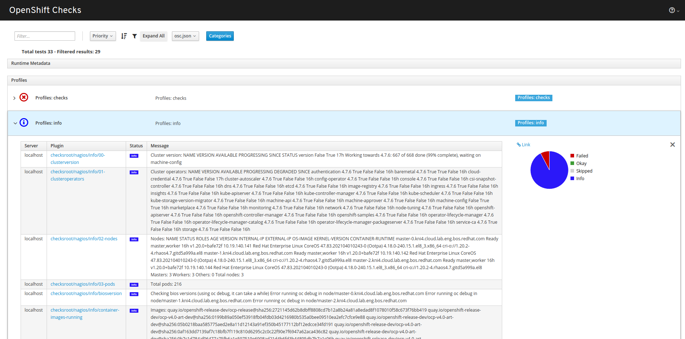

# openshift-checks

A set of scripts to run basic checks on an OpenShift cluster. PRs welcome!

> :warning: This is an unofficial tool, don't blame us if it breaks your cluster

## Usage

```bash
$ ./openshift-checks.sh -h
Usage: openshift-checks.sh [-h]

This script will run a minimum set of checks to an OpenShift cluster

Available options:

-h, --help                               Print this help and exit
-v, --verbose                            Print script debug info
-l, --list                               Lists the available checks
-s <script>, --single <script>           Executes only the provided script
--no-info                                Disable cluster info commands (default: enabled)
--no-checks                              Disable cluster check commands (default: enabled)
--no-ssh                                 Disable ssh-based check commands (default: enabled)
--prechecks path/to/install-config.yaml  Executes only prechecks (default: disabled)

With no options, it will run all checks and info commands with no debug info
```

### Container

There is an automated container build configured with the content of this
repository main branch available at
[quay.io/rhsysdeseng/openshift-checks](https://quay.io/rhsysdeseng/openshift-checks).

You can use it with your own `kubeconfig` file and with the parameters required
as:

```bash
$ podman run -it --rm -v /home/foobar/kubeconfig:/kubeconfig:Z -e KUBECONFIG=/kubeconfig quay.io/rhsysdeseng/openshift-checks:latest -h
```

You can even create a handy alias:

```bash
$ alias openshift-checks="podman run -it --rm -v /home/foobar/kubeconfig:/kubeconfig:Z -e KUBECONFIG=/kubeconfig quay.io/rhsysdeseng/openshift-checks:latest"
```

Then, simply run it as:

```bash
$ openshift-checks -s info/00-clusterversion
Using default/api-foobar-example-com:6443/system:admin context
...
```

### Build your own container

You can build your own container with the included
[Containerfile](Containerfile):

```bash
$ podman build --tag foobar/openshiftchecks .
STEP 1: FROM registry.access.redhat.com/ubi8/ubi:latest
...
$ podman push foobar/openshiftchecks
...
```

Then, run it by replacing
`quay.io/repository/rhsysdeseng/openshift-checks:latest` with your own image
such as `foobar/openshiftchecks:latest`:

```bash
$ podman run -it --rm -v /home/foobar/kubeconfig:/kubeconfig:Z -e KUBECONFIG=/kubeconfig foobar/openshiftchecks:latest -h
Usage: openshift-checks.sh [-h]
...
```

### CronJob

The checks can be scheduled to run periodically in an OpenShift cluster by
creating a CronJob.

Check the [cronjob.yaml](cronjob.yaml) example.

## How it works

The `openshift-checks.sh` script is just a wrapper around bash scripts located
in the [info](./info), [checks](./checks) or [ssh](./ssh) directories.

### Checks

| Script                                                | Description                                                                                                               |
| ----------------------------------------------------- | ------------------------------------------------------------------------------------------------------------------------- |
| [alertmanager](checks/alertmanager)                   | Checks if there are warning or error alerts firing                                                                        |
| [bz1948052](checks/bz1948052)                         | Checks if the node is using a kernel version affected by [BZ1948052](https://bugzilla.redhat.com/show_bug.cgi?id=1948052) |
| [chronyc](checks/chronyc)                             | Checks if the worker clocks are synced using chronyc                                                                      |
| [clusterversion_errors](checks/clusterversion_errors) | Checks if there are clusterversion errors                                                                                 |
| [csr](checks/csr)                                     | Checks if there are pending csr                                                                                           |
| [ctrlnodes](checks/ctrlnodes)                         | Checks if any controller nodes have had the NoSchedule taint removed                                                      |
| [entropy](checks/entropy)                             | Checks if the workers have enough entropy                                                                                 |
| [iptables-22623-22624](checks/iptables-22623-22624)   | Checks if the nodes iptables rules are blocking 22623/tpc or 22624/tcp                                                    |
| [mcp](checks/mcp)                                     | Checks if there are degraded mcp                                                                                          |
| [nodes](checks/nodes)                                 | Checks if there are not ready or not schedulable nodes                                                                    |
| [notrunningpods](checks/notrunningpods)               | Checks if there are not running pods                                                                                      |
| [operators](checks/operators)                         | Checks if there are operators in 'bad' state                                                                              |
| [pdb](checks/pdb)                                     | Checks if there are PodDisruptionBudgets with 0 disruptions allowed                                                  |
| [port-thrasing](checks/port-thrasing)                 | Checks if there are OVN pods thrasing                                                                                     |
| [restarts](checks/restarts)                           | Checks if there are pods restarted > `n` times (10 by default)                                                            |
| [terminating](checks/terminating)                     | Checks if there are pods terminating                                                                                      |

### SSH Checks

| Script                     | Description                                                                                                                                   |
| -------------------------- | --------------------------------------------------------------------------------------------------------------------------------------------- |
| [bz1941840](ssh/bz1941840) | Checks if the authentication-operator is using excessive RAM -> hung kubelet [BZ1941840](https://bugzilla.redhat.com/show_bug.cgi?id=1948052) |

### Info

| Script                                                      | Description                                                         |
| ----------------------------------------------------------- | ------------------------------------------------------------------- |
| [clusterversion](info/00-clusterversion)                    | Show the clusterversion                                             |
| [clusteroperators](info/01-clusteroperators)                | Show the clusteroperators                                           |
| [nodes](info/02-nodes)                                      | Show the nodes status                                               |
| [pods](info/03-pods)                                        | Show the pods running in the cluster                                |
| [machineset](info/04-machineset)                            | Show the machinesets status                                         |
| [biosversion](info/biosversion)                             | Show the nodes' BIOS version                                        |
| [bmh-machine-node](info/bmh-machine-node)                   | Show the node,machine and bmh relationship                          |
| [container-images-running](info/container-images-running)   | Show the images of the containers running in the cluster            |
| [container-images-stored](info/container-images-stored)     | Show the container images stored in the cluster hosts               |
| [ethtool-firmware-version](info/ethtool-firmware-version)   | Show the nodes' NIC firmware version using ethtool                  |
| [mellanox-firmware-version](info/mellanox-firmware-version) | Show the nodes' Mellanox Connect-4 firmware version                 |
| [intel-firmware-version](info/intel-firmware-version)       | Reports firmware versions of supported Intel cards if any are found |
| [mtu](info/mtu)                                             | Show the nodes' MTU for some interfaces                             |
| [node-versions](info/node-versions)                         | Show node components versions such as kubelet, crio, kernel, etc.   |
| [ovs-hostnames](info/ovs-hostnames)                         | Show the ovs database chassis hostnames                             |

### Prechecks

| Script                                                        | Description                                                 |
| ------------------------------------------------------------- | ----------------------------------------------------------- |
| [install-config-valid-yaml](pre/00-install-config-valid-yaml) | Checks if the install-config.yaml file is a valid yaml file |
| [dns-hostnames](pre/dns-hostnames)                            | Checks if the api and wildcard DNS entries are correct      |

### Environment variables

| Environment variable | Default value                                        | Description                                                                       |
| -------------------- | ---------------------------------------------------- | --------------------------------------------------------------------------------- |
| INTEL_IDS            | 8086:158b                                            | Intel device IDs to check for firmware. Can be overridden for non-supported NICs. |
| OCDEBUGIMAGE         | registry.redhat.io/rhel8/support-tools:latest        | Used by `oc debug`.                                                               |
| OSETOOLSIMAGE        | registry.redhat.io/openshift4/ose-tools-rhel8:latest | Used by `oc debug` in [ethtool-firmware-version](info/ethtool-firmware-version)   |
| RESTART_THRESHOLD    | 10                                                   | Used by the [restarts](checks/restarts) script.                                   |
| THRASING_THRESHOLD   | 10                                                   | Used by the [port-thrashing](checks/port-thrashing) script.                       |
| PARALLELJOBS         | 1                                                    | By default, all the `oc debug` commands run in a serial fashion, unless this variable is set >1 |

### About firmware version

The current [intel-firmware-version](info/intel-firmware-version) and
[mellanox-firmware-version](info/mellanox-firmware-version) checks only check
the firmware version of the SRIOV operator supported NICs ([in 4.6](https://docs.openshift.com/container-platform/4.6/networking/hardware_networks/about-sriov.html#supported-devices_about-sriov)).

You can add your own device ID if needed by modifying the script (hint, the
variable is called `IDS` and the format is `vendorID_A:deviceID_A vendorID_B:deviceID_B`)

## Collaborate

Add a new script to get some information or to perform some check in the proper
folder and create a pull request.

## Tips & Tricks

### Send an email if some check fails

You can pipe the script to `mail` and if there are any errors, an email will be
sent.

First you can configure postfix (already included in RHEL8) as relay host
(see https://access.redhat.com/solutions/217503). As an example:

- Append the following settings in `/etc/postfix/main.cf`:

```bash
myhostname = kni1-bootstrap.example.com
relayhost = smtp.example.com
```

- Restart the postfix service:

```bash
sudo systemctl restart postfix
```

- Test it:

```bash
echo "Hola" | mail -s 'Subject' johndoe@example.com
```

Then, run the script as:

```bash
/openshift-checks.sh > /tmp/oc-errors 2>&1 || mail -s "Something has failed" johndoe@example.com < /tmp/oc-errors
```

As a bonus you can include this in a cronjob for periodic checks.

### Get JSON and HTML output

This requires installation of python requirements in the `requirements.txt` file, preferable within a virtual environment, once those are installed execute:

```bash
./risu.py -l
```

To automatically execute the tests against the current environment and generate two output files:

- `osc.json`
- `osc.html`

When loaded over a web server, the html file will pull the `json` file over AJAX and represent the results of the tests in a graphical way:


